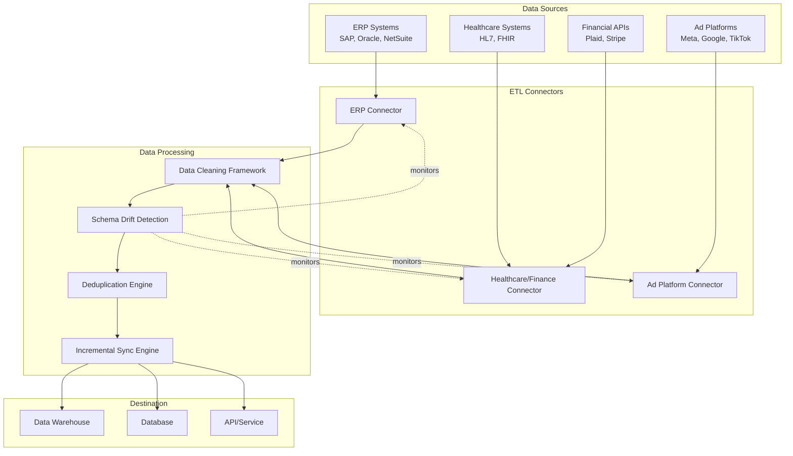

# ETL Component Prompts

A comprehensive collection of production-ready prompts for building enterprise-grade ETL (Extract, Transform, Load) systems. Each prompt is designed to be copy-pasted directly into AI coding assistants to generate robust, production-ready data pipeline components.

## Overview

These prompts address the real-world challenges of data integration: legacy systems with inconsistent formats, encoding nightmares, schema drift, duplicate records, and the political reality that "customer_id" means different things in different systems. Each component is designed to handle edge cases gracefully while providing transparency and observability.

## The 7 ETL Components

### 1. ERP Connector (`01-erp-connector-prompt.md`)
Extract data from legacy ERP systems (SAP, Oracle, NetSuite, Microsoft Dynamics) using multiple protocols (REST, SOAP, ODBC, file exports). Handles authentication, pagination, rate limiting, and the myriad ways these systems represent nulls, dates, and encodings.

**Use when**: You need to extract data from enterprise ERP systems with proprietary APIs or legacy protocols.

### 2. Healthcare & Finance Connector (`02-healthcare-finance-connector-prompt.md`)
Process healthcare standards (HL7, FHIR) and financial APIs (Plaid, Stripe, QuickBooks, X12 EDI). Handles complex nested structures, compliance requirements (HIPAA, PCI-DSS), and industry-standard formats that are simultaneously rigid and ambiguous.

**Use when**: You're working with healthcare data (patient records, medical transactions) or financial data (banking, payments, accounting).

### 3. Ad Platform Connector (`03-ad-platform-connector-prompt.md`)
Extract marketing data from advertising platforms (Meta, Google Ads, TikTok). Handles OAuth2 flows, async report generation, rate limits, and the frequent API version changes that break integrations.

**Use when**: You need to sync campaign performance, audience, or ad data from marketing platforms.

### 4. Data Cleaning Framework (`04-data-cleaning-framework-prompt.md`)
Clean and normalize messy data: string normalization, type coercion, date parsing with ambiguity resolution, null handling, encoding detection. Provides data quality scoring and transformation logs.

**Use when**: Your data has inconsistent formats, encoding issues, or needs standardization before processing.

### 5. Deduplication Engine (`05-deduplication-engine-prompt.md`)
Identify and merge duplicate records using fuzzy matching, phonetic algorithms, and entity resolution. Handles false positives, false negatives, and provides confidence scores with manual review queues.

**Use when**: You have duplicate records with slight variations (typos, formatting differences, name changes).

### 6. Schema Drift Detection (`06-schema-drift-detection-prompt.md`)
Detect schema changes in source systems, analyze their impact on downstream pipelines, and provide migration suggestions. Handles backward-incompatible changes, gradual evolution, and nested structure changes.

**Use when**: Source systems change schemas without notice and you need to prevent pipeline breaks.

### 7. Incremental Sync Engine (`07-incremental-sync-engine-prompt.md`)
Sync only changed data using various CDC methods (timestamps, version numbers, change logs). Handles late-arriving data, conflicts, and maintains state for recovery.

**Use when**: You need to efficiently sync large datasets by processing only changes, not full refreshes.

## Architecture



## Usage Guide

### How to Use These Prompts

1. **Choose the Right Component**: Review the overview above to identify which component(s) you need.

2. **Copy the Prompt**: Open the relevant prompt file and copy its entire contents.

3. **Customize for Your System**: 
   - Replace placeholder values (e.g., `[SYSTEM_TYPE]`, `[FIELD_NAMES]`)
   - Adjust configuration examples to match your environment
   - Specify your data sources, destinations, and requirements

4. **Paste into AI Assistant**: Paste the customized prompt into your AI coding assistant (Claude, ChatGPT, GitHub Copilot, etc.).

5. **Iterate**: The AI will generate code. Review, test, and refine. Use the prompt's "Testing Requirements" section to guide your testing.

### Customization Guide

Each prompt includes placeholders and configuration examples. Here's how to customize them:

#### For Connectors (1-3)
- **System Type**: Replace `[SYSTEM_TYPE]` with your specific system (e.g., `sap`, `netsuite`, `plaid`)
- **Credentials**: Update connection strings, API keys, OAuth credentials
- **Data Sources**: Specify tables, endpoints, or resources to extract
- **Field Mappings**: Define how source fields map to your schema

#### For Processing Components (4-7)
- **Field Names**: Replace `[FIELD_NAMES]` with your actual field names
- **Rules**: Customize cleaning rules, matching thresholds, conflict resolution policies
- **Configuration**: Adjust YAML configuration examples to match your needs
- **Integration Points**: Specify how components integrate with your pipeline

### Best Practices

#### When to Use Which Component

**Start with Connectors** if you need to extract data from external systems:
- Use ERP Connector for legacy enterprise systems
- Use Healthcare/Finance Connector for regulated industries
- Use Ad Platform Connector for marketing data

**Always Use Data Cleaning** after extraction:
- Raw data from any source needs cleaning
- Run cleaning before other processing steps
- Use quality scores to identify problematic data

**Use Deduplication** when you have:
- Multiple data sources with overlapping data
- Historical data that may contain duplicates
- Data merged from different systems

**Use Schema Drift Detection** when:
- Source systems change schemas frequently
- You have multiple downstream consumers
- Schema changes break pipelines

**Use Incremental Sync** when:
- Full syncs are too slow or expensive
- You need near-real-time data updates
- Source systems support change tracking

#### Component Ordering

A typical ETL pipeline follows this order:

1. **Connectors** → Extract data from sources
2. **Data Cleaning** → Normalize and clean extracted data
3. **Schema Drift Detection** → Monitor for schema changes (runs in parallel)
4. **Deduplication** → Remove duplicates
5. **Incremental Sync** → Load only changes to destination

#### Integration Patterns

**Sequential Processing**:
```
Connector → Cleaning → Deduplication → Sync
```

**Parallel Processing**:
```
Connector A ─┐
Connector B ─┼→ Cleaning → Deduplication → Sync
Connector C ─┘
```

**With Monitoring**:
```
Connector → Cleaning → Deduplication → Sync
     ↓           ↓           ↓         ↓
Schema Drift Detection (monitors all stages)
```

## Example Workflow

### Building a Customer Data Pipeline

Let's build a complete ETL pipeline that extracts customer data from multiple sources, cleans it, deduplicates, and syncs to a data warehouse.

#### Step 1: Extract from ERP System
Use `01-erp-connector-prompt.md`:
- Customize for your ERP (e.g., NetSuite)
- Configure to extract customer table
- Set up incremental extraction using `updated_at` timestamp

#### Step 2: Extract from CRM System
Use `01-erp-connector-prompt.md` again (or appropriate connector):
- Configure for your CRM system
- Extract contacts/accounts
- Map CRM fields to customer schema

#### Step 3: Clean and Normalize
Use `04-data-cleaning-framework-prompt.md`:
- Configure cleaning rules for customer fields
- Normalize phone numbers, emails, addresses
- Handle null values and encoding issues
- Generate quality scores

#### Step 4: Detect Schema Changes
Use `06-schema-drift-detection-prompt.md`:
- Monitor ERP and CRM schemas
- Configure alerts for breaking changes
- Set up impact analysis for downstream pipelines

#### Step 5: Deduplicate Customers
Use `05-deduplication-engine-prompt.md`:
- Configure matching on name, email, phone
- Set similarity thresholds
- Configure merge strategy (keep most complete)
- Queue low-confidence matches for review

#### Step 6: Incremental Sync to Warehouse
Use `07-incremental-sync-engine-prompt.md`:
- Configure CDC using timestamps
- Set up conflict resolution (last-write-wins)
- Configure checkpointing for recovery
- Sync to data warehouse

### Complete Pipeline Code Structure

```python
# pipeline.py
from connectors import ERPConnector, CRMConnector
from cleaning import DataCleaningFramework
from deduplication import DeduplicationEngine
from schema_drift import SchemaDriftDetector
from sync import IncrementalSyncEngine

# 1. Extract
erp_connector = ERPConnector(config="erp_config.yaml")
crm_connector = CRMConnector(config="crm_config.yaml")

erp_data = erp_connector.extract()
crm_data = crm_connector.extract()

# 2. Clean
cleaner = DataCleaningFramework(config="cleaning_config.yaml")
cleaned_erp = cleaner.clean(erp_data)
cleaned_crm = cleaner.clean(crm_data)

# 3. Monitor schemas (runs in background)
schema_detector = SchemaDriftDetector(config="schema_config.yaml")
schema_detector.monitor([erp_connector, crm_connector])

# 4. Deduplicate
deduplicator = DeduplicationEngine(config="dedup_config.yaml")
combined_data = combine(cleaned_erp, cleaned_crm)
deduplicated = deduplicator.deduplicate(combined_data)

# 5. Sync
syncer = IncrementalSyncEngine(config="sync_config.yaml")
syncer.sync(deduplicated, destination="data_warehouse")
```

## Testing Strategy

Each prompt includes testing requirements. Here's a comprehensive testing approach:

### Unit Tests
- Test each component in isolation
- Mock external dependencies (APIs, databases)
- Test edge cases and error handling

### Integration Tests
- Test components together
- Use test databases/APIs
- Verify data flows correctly

### End-to-End Tests
- Test complete pipeline
- Use production-like data
- Verify final output quality

### Performance Tests
- Test with large datasets (100K+ records)
- Measure processing time and memory usage
- Identify bottlenecks

### Failure Tests
- Test error recovery
- Test state recovery after failures
- Test conflict resolution

## Monitoring & Observability

Each component generates metrics and logs. Set up monitoring for:

- **Extraction Metrics**: Records extracted, errors, duration
- **Cleaning Metrics**: Quality scores, transformation counts
- **Deduplication Metrics**: Duplicates found, merge decisions
- **Schema Metrics**: Changes detected, alerts sent
- **Sync Metrics**: Records synced, conflicts, latency

Use these metrics to:
- Identify data quality issues early
- Monitor pipeline health
- Optimize performance
- Debug issues

## Contributing

These prompts are designed to be extended. To add a new component:

1. Follow the existing prompt structure
2. Include all required sections (Context, Core Functionality, Edge Cases, etc.)
3. Provide realistic examples and configuration
4. Acknowledge real-world data challenges
5. Include testing requirements

## License

These prompts are provided as-is for use in building ETL systems. Adapt them to your specific needs and requirements.

## Support

For questions or issues with these prompts:
1. Review the specific prompt file for detailed guidance
2. Check the "Usage Example" and "Testing Requirements" sections
3. Customize the prompts for your specific use case
4. Iterate and refine based on your results

---

**Remember**: These prompts acknowledge the dirty reality of real-world data. They're designed to handle the edge cases, inconsistencies, and quirks that break naive implementations. Use them as starting points, customize for your domain, and build robust, production-ready data pipelines.

